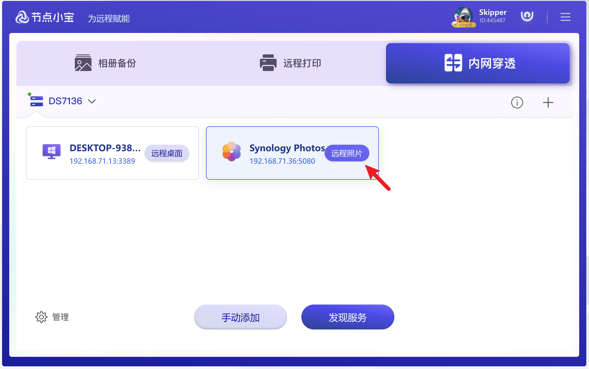

# Synology Photos

1. ## 获取服务

前往Synology套件中心安装**Synology Photos**

<figure><figcaption></figcaption></figure>

2. ## 开启服务

前往 控制面板->登录门户->应用程序->开启http服务为默认端口即可

<figure><figcaption></figcaption></figure>

<figure><figcaption></figcaption></figure>

<figure><figcaption></figcaption></figure>

3. ## 访问服务

通过节点小宝客户端，点击服务即可一键直达

<figure><figcaption></figcaption></figure>
