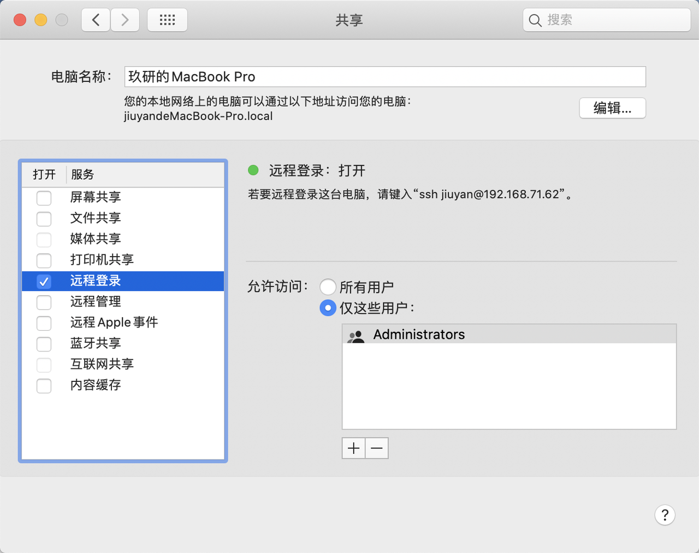

# 开启Mac远程桌面

1. 可以通过聚焦搜索或者系统设置开启Mac远程桌面

* 聚焦搜索：
  * command⌘ + 空格&#x20;
  * 搜索：“<mark style="color:purple;">**VNC**</mark>”或“<mark style="color:purple;">**远程管理**</mark>”进入设置页面
* 系统设置：
  * 系统设置->共享->开启“远程管理”

<figure><figcaption></figcaption></figure>

* macOS-13（Ventura）系统设置->通用->共享->开启“远程管理”
* 可以点击“i”来设置相关的访问权限或访问密码

<figure><figcaption></figcaption></figure>
